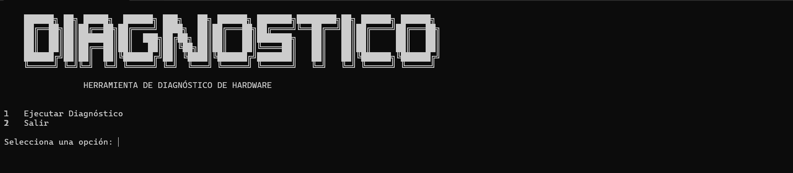

# 🖥️ Herramienta de diagnóstico de hardware

Herramienta en Python para diagnosticar hardware y estado del sistema en equipos Windows.  
Permite obtener información detallada del sistema, CPU, RAM, discos, batería y uso del almacenamiento de forma rápida desde la terminal.

---

## Versión

**Versión actual:** v1.0  

Este proyecto se encuentra en su primera versión y se estará **actualizando constantemente** con nuevas funcionalidades, mejoras y optimizaciones.

---

## 📸 Vista previa



---

## ⚙️ Características actuales

- Información del sistema operativo
- Detalles de CPU
- Información de memoria RAM
- Información de discos
- Estado de batería
- Temperatura del sistema (si está disponible)
- Uso del almacenamiento
- Recomendaciones de mejora de hardware
- Interfaz en terminal con menú interactivo

---

## 🔮 Próximas mejoras 

Algunas funcionalidades que se planean agregar:

- Exportar diagnóstico a PDF
- Detección de GPU
- Diagnóstico de salud del disco
- Reporte automático para soporte técnico
- Versión ejecutable (.exe)
- Compatibilidad con mas sistemas operativos
- Sistema de logs
- Modo profesional para técnicos

---

## 🛠️ Instalación
```bash
git clone https://github.com/tu-usuario/hardware-diagnostic.git
cd hardware-diagnostic
python diagnostico.py

