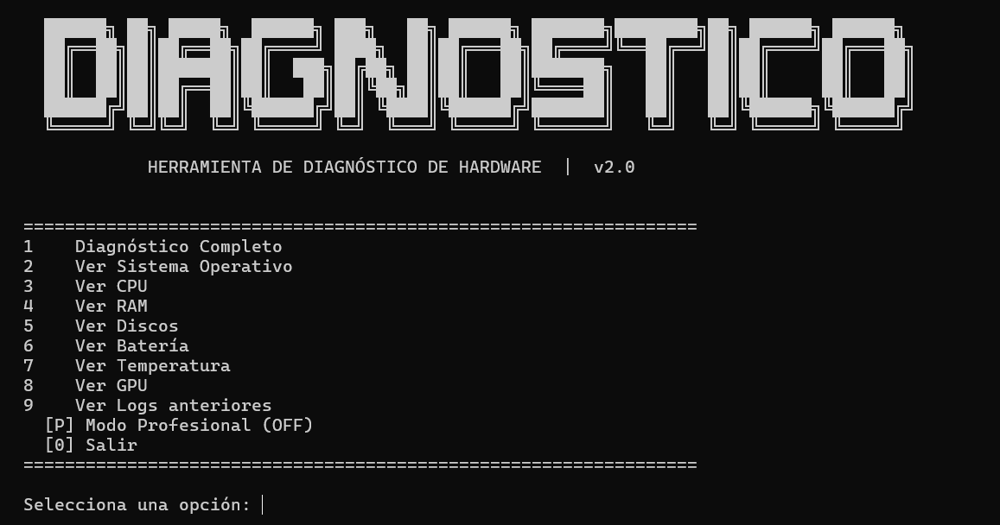

# Herramienta de Diagnóstico de Hardware 

Herramienta en Python para diagnosticar hardware y estado del sistema en equipos Windows. Permite obtener información detallada del sistema, CPU, RAM, discos, GPU, batería y temperatura de forma rápida desde la terminal.



---

## Instalación

```bash
git clone https://github.com/tu-usuario/hardware-diagnostico.git
cd hardware-diagnostico
pip install -r requirements.txt
python main.py
```

---

## Dependencias

| Librería | Para qué sirve | Instalar con |
|---|---|---|
| `GPUtil` | Detectar GPU NVIDIA (uso, VRAM, temperatura) | `pip install GPUtil` |
| `reportlab` | Exportar diagnóstico a PDF | `pip install reportlab` |

> `psutil`, `wmi` y `pywin32` ya eran requeridas en v1.0.

---
## Autor

**Salvador Hernández Juárez**

[](https://github.com/SalvadorHernandezJuarez)

---
