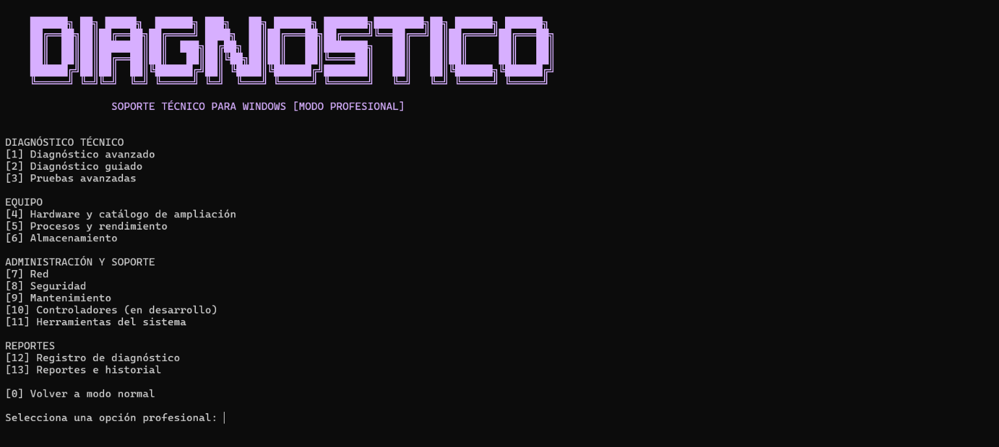

# Herramienta de Diagnóstico de Hardware 

Herramienta en Python para diagnosticar hardware y estado del sistema en equipos Windows. Permite obtener información detallada del sistema, CPU, RAM, discos, GPU, batería y temperatura de forma rápida desde la terminal.



---

## Instalación

```bash
git clone https://github.com/tu-usuario/hardware-diagnostico.git
cd hardware-diagnostico
pip install -r requirements.txt
python main.py
```

## Crear el ejecutable de Windows

Con Python instalado, instala las dependencias y PyInstaller:

```bash
python -m pip install -r requirements.txt
python -m pip install pyinstaller
```

Después, desde la carpeta del proyecto, ejecuta:

```bash
pyinstaller --clean --noconfirm main.spec
```

El ejecutable se generará en `dist/DiagnosticoHardware.exe`. Puedes copiarlo a otra carpeta; los directorios `logs` y `reports` se crearán junto al ejecutable cuando se utilicen. Como la aplicación funciona mediante un menú de terminal, debe abrirse desde una consola o haciendo doble clic en el archivo.

---

## Dependencias

| Librería | Para qué sirve | Instalar con |
|---|---|---|
| `GPUtil` | Detectar GPU NVIDIA (uso, VRAM, temperatura) | `pip install GPUtil` |
| `reportlab` | Exportar diagnóstico a PDF | `pip install reportlab` |

> `psutil`, `wmi` y `pywin32` ya eran requeridas en v1.0.

---

## Modo profesional

En el menú principal existe un modo técnico para soporte:

- se activa con la opción `P` desde el menú normal
- muestra información adicional por módulo
- calcula un estado general del equipo (`OK`, `ALERTA`, `CRÍTICO`)
- prioriza problemas por nivel de riesgo
- recomienda acciones inmediatas según RAM, disco, temperatura, batería y GPU
- incluye menús independientes con diagnóstico de red y auditoría de seguridad de Windows
- usa una paleta morada y cian para identificar el modo profesional
- incluye un catálogo local de ampliación de hardware: puede detectar el modelo del equipo, buscar modelos y consultar capacidades máximas de RAM y SSD
- el catálogo se puede cargar desde Excel y se conserva en una base SQLite local

### Catálogo de ampliación de hardware

En el menú Hardware del modo profesional, selecciona **C. Catálogo de ampliación por modelo**. Puedes buscar modelos del catálogo, consultar el equipo detectado por Windows o crear una plantilla de Excel. Captura los datos en la hoja `Catalogo`, conserva los encabezados y selecciona **Importar o actualizar desde Excel**. Los registros se guardan en `datos_ampliacion/compatibilidad.db`, junto al proyecto o ejecutable.

La plantilla admite marca, modelo, RAM máxima y soldada, tipo y ranuras de RAM, SSD máximo, interfaces de almacenamiento, notas, fuente y fecha de verificación. Cada fila debe incluir al menos una capacidad máxima y su fuente y fecha de verificación. La consulta automática solo muestra coincidencias exactas de marca y modelo; si no encuentra una, permite buscar el modelo manualmente. Verifica capacidades y variantes contra fuentes del fabricante antes de incorporarlas.

## Módulo de hardware

La opción **Hardware** está disponible en modo Normal y Profesional. Presenta procesador, RAM, almacenamiento, GPU, placa base, BIOS/UEFI, batería, pantalla, audio, dispositivos conectados, un resumen completo y capacidad de expansión. La tecla **T** conserva la vista de temperatura; en modo Profesional, **C** abre el catálogo local de ampliación por modelo.

`modules/hardware.py` concentra la recolección en funciones que devuelven diccionarios estructurados, independientes de la presentación CMD. Usa `psutil`, WMI y, si el paquete `wmi` no está instalado, consultas CIM de PowerShell en Windows. La información ausente se representa como `None` y los errores de consulta se registran en `logs/hardware_diagnostico.log`. La interfaz normal prioriza indicadores básicos; la profesional incluye identificadores, números de serie y campos SMBIOS/controladores disponibles.

La capacidad máxima SMBIOS se etiqueta como reportada, no como confirmada. Los conectores libres M.2/SATA no se deducen de las unidades detectadas: solo se muestran cuando una fuente del catálogo informa interfaces; de otro modo aparecen como desconocidos. Los datos completos quedan disponibles como diccionarios para la futura capa de diagnóstico y reportes.

## Diagnóstico de red

La opción **5. Diagnóstico de red** en modo Normal y **7. Red** en modo Profesional ofrecen adaptadores, configuración IP, gateway, DNS, conectividad externa, ping, traceroute y diagnóstico automático por capas. `modules/red.py` devuelve estructuras `NetworkAdapter`, `NetworkConfiguration`, `PingResult`, `DnsResult`, `GatewayResult` y `NetworkDiagnosticResult`; `ui/red.py` las presenta en CMD y guarda diagnósticos/acciones en el historial.

La inspección usa `psutil`, PowerShell `Get-NetIPConfiguration`/`Get-NetAdapter`, `netsh wlan show interfaces`, `ping`, `tracert`, resolución DNS UDP y sockets TCP. DNS/IP/gateway se prueban antes de las conexiones externas; gateway inaccesible detiene las pruebas posteriores. La conectividad externa se verifica con conexiones TCP a destinos IP en puerto 443 y DNS se comprueba independientemente. Un salto `* * *` no se trata como fallo.

La latencia y pérdida de paquetes se miden con cuatro pings; los límites se centralizan en `modules/red.py` (`150 ms` de latencia promedio y `10%` de pérdida). `169.254.x.x` se presenta como indicio de posible problema DHCP, no como causa confirmada. Los errores o proveedores ausentes no detienen las otras pruebas.

`[9] Renovar configuración IP` solicita confirmación explícita antes de `ipconfig /release` y `ipconfig /renew`. `[10] Restablecimiento de red` solo aparece en el submenú de red del modo Profesional y requiere escribir literalmente `CONFIRMAR`; ejecuta `netsh winsock reset` y `netsh int ip reset` y puede requerir reiniciar Windows. Estas acciones no se ejecutan desde el diagnóstico automático.

## Seguridad de Windows

La opción **6. Diagnóstico de seguridad** en modo Normal y **8. Seguridad** en modo Profesional presentan firewall por perfil, Microsoft Defender y protección en tiempo real, BitLocker por volumen, versión/compilación y actualizaciones pendientes, cuentas locales y administradores, servicios de seguridad, UAC, Secure Boot y TPM. La opción **Auditoría completa** recopila los controles disponibles; Modo Profesional incluye evidencia, códigos, timestamps y comandos/fuentes.

`modules/security.py` obtiene la información mediante PowerShell/CIM, Windows Update Agent y cmdlets nativos. La búsqueda potencialmente lenta de Windows Update se ejecuta separada y tiene un límite de 12 segundos; si expira, las demás comprobaciones se conservan y Updates aparece como **No disponible**. Los hallazgos usan `DiagnosticResult` y `Severity`, y el resultado estructurado se guarda en el historial existente. Proveedores ausentes, permisos insuficientes y firmware sin Secure Boot se representan como **No disponible** o informativos; no se confunden con fallas confirmadas. Un Defender apagado no se califica como inseguridad si Windows registra otro antivirus. La ausencia de BitLocker y TPM se reporta como información, y una cuenta administrativa no se califica por sí sola como vulnerabilidad.

La auditoría es de solo lectura: no activa protecciones, instala actualizaciones, modifica usuarios, servicios, registro ni políticas. La búsqueda de Windows Update solo enumera actualizaciones pendientes. Si una consulta no está disponible, las demás comprobaciones continúan y el error se registra.

## Mantenimiento de Windows

La opción **7. Mantenimiento** en el menú Normal y **9. Mantenimiento** en el Profesional abre un submenú CMD para procesos, RAM, temporales, papelera, programas de inicio, servicios, almacenamiento y recomendaciones. Reutiliza `modules/procesos.py` en los diagnósticos existentes y agrega `modules/mantenimiento.py` para inventario estructurado (`MaintenanceAuditResult`, `MaintenanceCheck`, `DiagnosticResult`) y acciones con equipo, usuario, timestamp, riesgo, resultado y error.

Finalizar procesos, eliminar temporales, vaciar la papelera y cambiar programas de inicio requiere escribir exactamente `CONFIRMAR`. Se protegen procesos críticos de Windows. El limpiador se limita a `%TEMP%` dentro del perfil del usuario y `%WINDIR%\Temp`, omite enlaces/reparse points y solo considera archivos de más de 24 horas; no elimina carpetas ni archivos activos. El vaciado de la papelera usa PowerShell nativo. Los elementos de inicio de carpetas se renombran con una extensión reversible `.hd-disabled`; valores de registro Run se guardan en una clave local reversible antes de quitarlos de la ejecución automática, y el menú permite restaurarlos.

La lectura de servicios y almacenamiento no modifica el equipo. El escaneo de directorios con mayor consumo solo se presenta en modo Profesional y tiene un límite de entradas. Iniciar o detener servicios requiere Modo Profesional y confirmación exacta; reiniciar requiere confirmación. El módulo limita los cambios a una lista de servicios permitidos y bloquea servicios centrales y de protección como RPC, Firewall y Defender. «Mantenimiento recomendado» solo analiza y recomienda, sin ejecutar acciones.

## Herramientas del sistema

**Herramientas del sistema** es exclusiva del menú Profesional (**11**); no aparece en el menú Normal. Ofrece información de Windows, variables de entorno, procesos, servicios, controladores, dispositivos, adaptadores de red y eventos recientes. Reutiliza `MaintenanceDiagnostics` para procesos y servicios, y `NetworkDiagnostics` para información de red. Los hallazgos y consultas se estructuran con `DiagnosticResult`; la información no disponible se presenta como **DESCONOCIDO** o se marca como no disponible.

Los comandos de diagnóstico son una lista fija de consultas (`sfc /verifyonly`, `ipconfig /all`, `route print`, `netstat -ano`, consulta de discos y `systeminfo`); no se aceptan comandos libres ni argumentos introducidos por el usuario. Se capturan salida, código de retorno, error y duración. La consola administrativa solo inicia herramientas nativas predefinidas y requiere Modo Profesional y escribir `CONFIRMAR`; no ejecuta comandos arbitrarios ni solicita elevación. Las operaciones son de consulta y no eliminan ni modifican información del sistema.

## Pruebas avanzadas

La opción **4. Pruebas** en el menú Normal y **3. Pruebas avanzadas** en el Profesional abre el módulo CMD de pruebas controladas. Reúne mediciones estructuradas para CPU, una muestra pequeña de RAM, almacenamiento, GPU, batería y red; la prueba completa continúa si un componente falla. Cada resultado usa `DiagnosticResult` con mediciones, severidad, código, duración, timestamps y errores. Una lectura no disponible no se interpreta automáticamente como una falla.

Las pruebas CPU, estabilidad y diagnóstico completo muestran una advertencia y requieren aceptación. La prueba CPU mantiene una carga moderada de un hilo por un máximo de 15 segundos; la estabilidad supervisa métricas hasta 120 segundos y detiene el muestreo ante el umbral térmico crítico. RAM comprueba hasta 16 MiB y no sustituye una prueba especializada. Almacenamiento escribe, sincroniza, lee/verifica y elimina únicamente su propio archivo temporal de hasta 4 MiB; no realiza pruebas destructivas. GPU consulta métricas disponibles, sin una carga sintética prolongada. Las pruebas pueden interrumpirse con Ctrl+C; no se realizan cambios de configuración, overclock ni operaciones sobre los datos del usuario.

## Reportes e historial

La opción **11. Reportes e historial** del menú Normal y **13. Reportes e historial** del Profesional abre el menú para generar, consultar, buscar, comparar y exportar diagnósticos. La opción Normal **12. Historial de diagnósticos** abre directamente la lista SQLite; el registro JSON previo sigue disponible en Profesional **12. Registro de diagnóstico**.

`reports/service.py` compone datos de Hardware/Diagnóstico general, Red, Seguridad, Mantenimiento y la última prueba avanzada en memoria, reutilizando los servicios existentes. Cada ejecución se guarda primero en `database/history.db` con resumen, metadatos y JSON estructurado para permitir su consulta aunque falle una exportación. Los reportes se guardan sin sobrescribir en `reports/txt/`, `reports/json/` y `reports/pdf/`; incluyen estado, hallazgos y recomendaciones. PDF mantiene el exportador anterior disponible para el diagnóstico guiado. El historial ofrece búsqueda por equipo, usuario, fecha o estado y una comparación de métricas comunes (CPU, RAM, almacenamiento, GPU, batería, red y estado general).

## Motor de diagnóstico determinístico

La opción **3. Diagnóstico general** (y **1. Diagnóstico avanzado** en modo Profesional) recopila CPU, RAM, almacenamiento, GPU, batería y sistema, evalúa reglas determinísticas y devuelve hallazgos `DiagnosticResult` sin imprimir desde el motor. Cada hallazgo contiene código, componente, severidad, descripción, evidencia, valores actual/esperado, recomendación, confianza, fuente y timestamp. El historial JSON guarda el resumen y los hallazgos, sin registrar la lista de procesos.

Los umbrales se centralizan en `core/thresholds.py`: RAM elevada/muy elevada/crítica **80/90/>95%**; CPU sostenida **85%** durante cinco muestras separadas **0.5 s**; temperatura CPU/GPU **85/95 °C**, almacenamiento **60/70 °C**, batería **45/60 °C**; espacio libre en disco **15/5% o 15/5 GB**; salud de batería baja **<80%** (desgaste severo **<40%**). Un pico aislado de CPU es informativo, las temperaturas/SMART ausentes son información y no fallas, y el desgaste de batería no se califica como crítico.

Si RAM alcanza 80%, el diagnóstico obtiene los cinco procesos con mayor memoria residente y muestra su consumo; no cierra procesos. El menú permite ver hallazgos y recomendaciones, generar un PDF y realizar un diagnóstico guiado para equipo lento, sobrecalentamiento, apagados, reinicios, Internet, poco espacio, batería, pantalla, audio u otro problema. Cada síntoma muestra hallazgos de los componentes pertinentes; los casos de red abren el diagnóstico automático y pantalla/audio muestran el inventario disponible, que no confirma por sí solo un fallo físico. La comprobación de actualizaciones pendientes y errores recientes del sistema aún no está habilitada y se conserva como no disponible.

## Arquitectura y navegación

La aplicación continúa siendo de terminal y puede iniciarse con `python main.py`. El encabezado de todas las pantallas identifica claramente **MODO NORMAL** o **MODO PROFESIONAL**. El menú Normal ofrece consultas y diagnósticos básicos; el diagnóstico guiado y las herramientas técnicas y administrativas del sistema están únicamente en el Profesional. Sus opciones están numeradas consecutivamente del 1 al 13. Las funciones compartidas, como hardware, red, seguridad, mantenimiento e historial, muestran más evidencia o acciones cuando se abren en modo Profesional. Las opciones profesionales no disponibles en modo Normal se ocultan allí, en vez de mostrarse para luego rechazarse; las opciones aún no implementadas se marcan como **en desarrollo**.

`core/` centraliza la ejecución de diagnósticos, sus resultados/severidades y la política de autorización de acciones. `ui/normal.py` y `ui/professional.py` separan los menús; los diagnósticos existentes en `modules/`, `utils/` y la exportación PDF se reutilizan. El programa registra inicio, modo, diagnósticos y errores en `logs/hardware_diagnostico.log`, además de conservar el historial JSON existente. Las acciones de red y mantenimiento requieren confirmación; otras acciones que alteren Windows todavía no están implementadas.

La severidad compartida es **NORMAL**, **INFORMACIÓN**, **ALERTA** o **CRÍTICO**. Las acciones futuras se clasifican como **SEGURA**, **CONFIRMACIÓN** o **PROFESIONAL**; las dos últimas requieren autorización, y las profesionales también requieren estar en modo profesional.

---
## Autor

**Salvador Hernández Juárez**

[](https://github.com/SalvadorHernandezJuarez)

---
